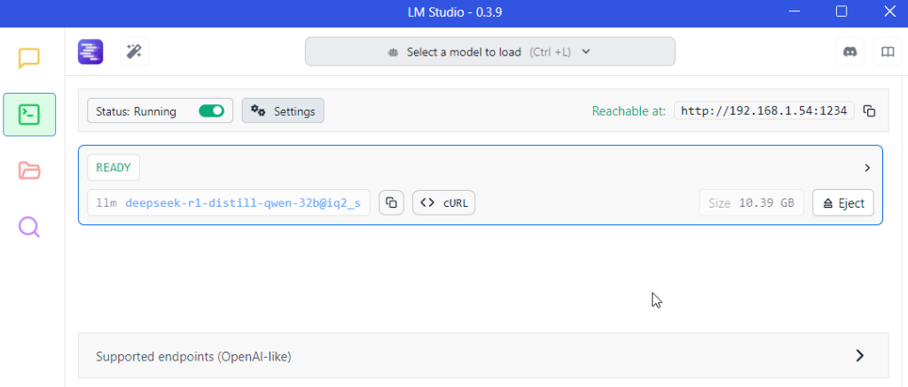

# Build a Stock Sentiment Analysis Program Using FREE LLMs with LangChain and Pydantic

In this example use case, let's build an AI system that can analyze market sentiment based on provided news articles with explanation using structured output to help investors catch-up with the news easier.


https://github.com/user-attachments/assets/6598e32b-6ef8-483b-ae1f-650b80982d0a

## Features
- **Company Identification**: Automatically detects publicly traded companies in news content
- **Sentiment Classification**: Categorizes sentiment as Positive, Negative, or Mixed
- **Confidence Scoring**: Provides numerical confidence levels as percentage for each analysis
- **Sentiment Justification**: Provides explanation of how the AI came up with the sentiment label based on your provided content.
- **Structured Output**: Returns validated JSON data with Pydantic models

## Installation

```bash
git clone https://github.com/krittaprot/structured-output-tutorial.git
cd structured-output-tutorial
python -m venv .llm_env
cd .llm_env
Scripts/activate (for windows) or source bin/activate (for mac)
cd ..
pip install -r requirements.txt
```

## Configuration

If you plan to use gemini model:
1. Get a [Google Gemini API key](https://aistudio.google.com/app/apikey)
2. Create `config.py` with:
```python
GEMINI_API_KEY = "your_api_key_here"
```
If you plan to use models loaded in lmstudio, please ensure proper settings as shown below:



Feel free to look up the LM Studio documentation for more info: https://lmstudio.ai/docs/api

## System & User Prompt

```python
# Create prompt template with detailed system message
system_prompt = """
               You are a senior financial analyst specializing in news sentiment analysis:
               1. Identify all publicly traded companies in the text
               2. For each company, determine sentiment using:
               - Financial performance metrics (exact figures/percentages)
               - Strategic developments (mergers, partnerships)
               - Regulatory/legal changes
               - Market reactions (stock moves, analyst ratings)

               3. Provide confidence scores as decimal values between 0 and 1 (e.g., 0.85 for 85% confidence).
               Never use percentage values for confidence scores.

               Include specific numerical data, quantified impacts, and precise metrics.
               Confidence scores must reflect evidence strength. Never invent information.
               """

user_prompt =   """ 
                    The current date is {current_date}, 
                    analyze the following article and provide sentiment analysis for each publicly traded company 
                    mentioned in the text below:
                    {article}
                """
```

## Usage

Run gemini model as default
```python
python main.py
or
python main.py --mode gemini #default to "gemini-2.0-flash-exp"
or
python main.py --mode gemini --model_name "gemini-2.0-flash-exp"
```

Pass in mode and model_name to run a specific model of choice from lmstudio or ollama
```python
python main.py --mode lmstudio --model_name "deepseek-r1-distill-qwen-32b@iq2_s"
python main.py --mode ollama --model_name "deepseek-r1:14b"
```

## Example Output

```
Model Used: bartowski/deepseek-r1-distill-qwen-32b@iq2_s
Analysis timestamp: 2025-02-01 00:00:00+00:00
Time taken to process the article: 182.87 seconds
**************************************************
Company: Apple Inc.
Sentiment: positive
Confidence: 85%
Justification: Apple reported Q1 sales of $124.3 billion, meeting views while EPS of $2.40 beat estimates by 5
cents. Services revenue rose 13.9%, but iPhone sales declined 1%. Apple stock hit an all-time high
in December but pulled back in January.

**************************************************
Company: Nvidia Corporation
Sentiment: negative
Confidence: 85%
Justification: Nvidia dropped nearly 4% as CEO Jensen Huang met President Trump to discuss export curbs and risks
from DeepSeek. The stock fell below its 200-day moving average after Monday's news of cheaper AI
models.

**************************************************
```

## Model Support

Currently compatible with:
- All Gemini Models (e.g., `gemini-2.0-flash-exp`, `gemini-2.0-flash-thinking-exp-01-21`, `gemini-exp-1206`, and etc.)
- Any OpenAI-compatible API endpoint including Ollama/LM Studio

## License

MIT License - See [LICENSE](LICENSE) for details

## Author

Maintained by [Krittaprot Tangkittikun](https://www.linkedin.com/in/krittaprot-tangkittikun-0103a9109/).
